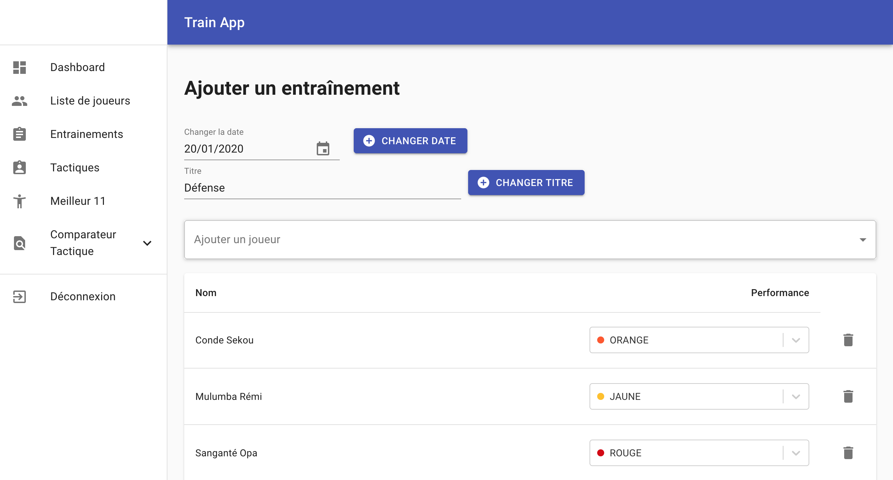
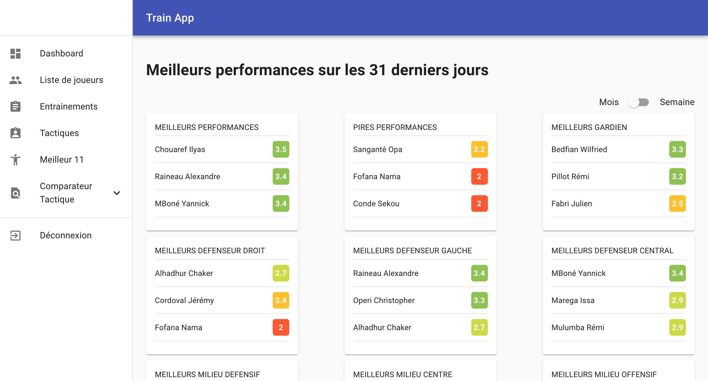
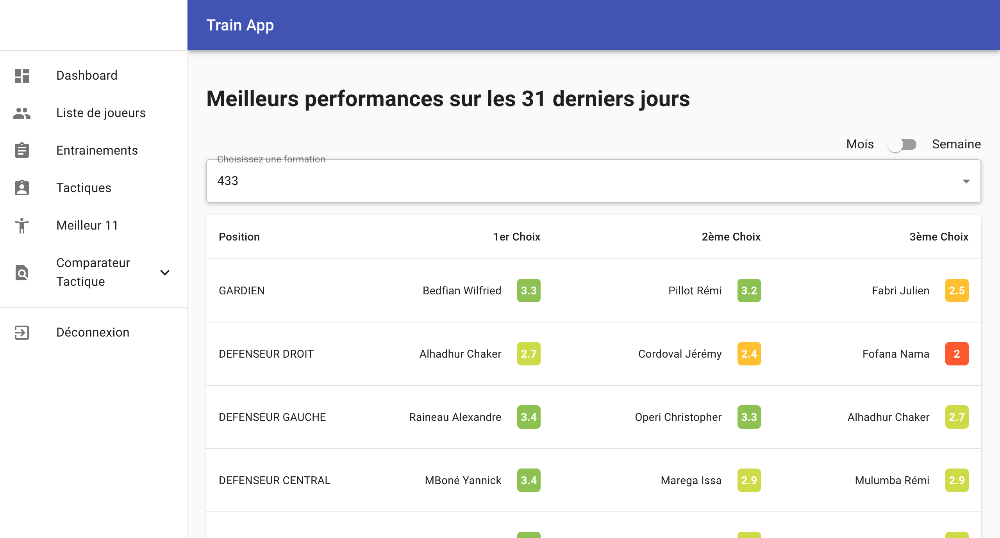
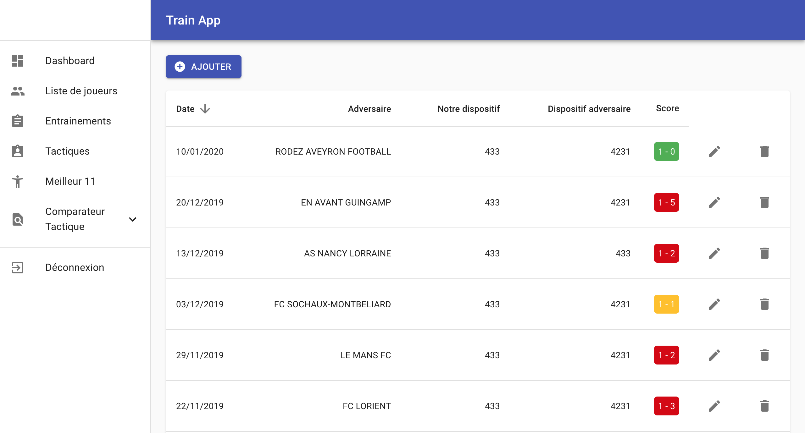
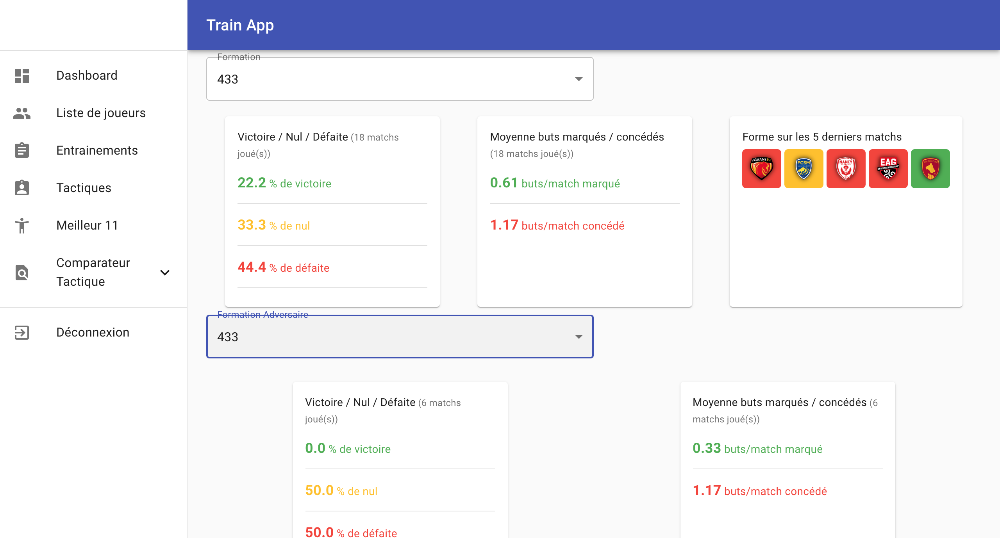

# Train App

Train App is a web app allowing football coach to monitor their player performances and enhance their decision-making process.

## Features

### Training Monitoring
Train App uses a system of color to monitor their player performances.

On their dashboard, coaches can see which player performed the best and the worst.

### Decision-making process
By gathering the training performance, the app can give you the best XI of any tactics relative to the player's week or month performance.

The app also let coach input their match results (score and tactics used during the game) to then see which tactics performed the best against which tactic

&nbsp;

